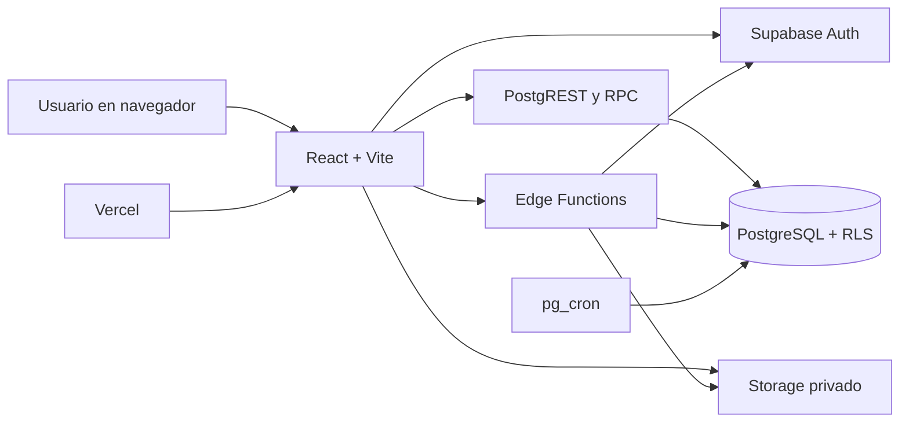

<p align="center">
  
</p>

# Sistema de Seguridad y Control de Accesos — EPN

Aplicación web para administrar identidades, puntos de control y accesos físicos de la Escuela
Politécnica Nacional. Integra personal interno y externo, biometría facial, vehículos, reglas de
acceso, operación de garitas, alertas, monitoreo y administración de usuarios en un único sistema
con permisos por rol.

> Proyecto académico de Ingeniería de Software I, periodo 2026-A. No constituye por sí solo una
> certificación ni una solución lista para operar infraestructura crítica en producción.

[Aplicación desplegada](https://security-system-epn.vercel.app) ·
[Manual de usuario](docs/MANUAL_DE_USUARIO.md) ·
[Guía de despliegue](docs/DESPLIEGUE.md)

## Funcionalidades

| Módulo | Funciones principales |
|---|---|
| Personal Interno (GPI) | Personas internas, datos académicos/laborales, biometría y vehículos. |
| Personal Externo (GPE) | Visitantes, proveedores, empresas, memorandos, autorizaciones diarias y vehículos. |
| Puntos de Control (PCO) | Zonas, garitas, dispositivos y turnos de guardias. |
| Control de Accesos (CAC) | Reglas, historial de ingresos/salidas, alertas y fallos de reconocimiento. |
| Administración (ADM) | Usuarios, roles, permisos, catálogos maestros, auditoría y sesiones. |
| Monitoreo | Vehículos dentro del campus, permanencia, eventos y alertas pendientes. |
| Garita | Identificación peatonal y vehicular, autorización de visitas y movimientos recientes. |

El panel muestra únicamente los módulos y acciones permitidos por el rol. Un guardia ingresa
directamente a su vista operativa, siempre que tenga una asignación y un turno vigentes.

## Arquitectura

El sistema es un monolito modular: todas las entidades maestras y reglas viven en una sola base
de datos. El frontend nunca contiene la clave `service_role` y la seguridad no depende de ocultar
botones; PostgreSQL aplica RLS y permisos en cada operación.



Principios importantes:

- `persona`, `vehiculo`, `empresa` y `categoria_persona` son entidades maestras únicas.
- No existe eliminación física desde la aplicación; las bajas cambian el estado y conservan el
  histórico.
- `evento_acceso` y `bitacora_sistema` son registros históricos.
- El personal interno se identifica físicamente mediante rostro; el externo, mediante cédula y
  una vigencia válida.
- La placa identifica el vehículo, pero cada ocupante se autoriza individualmente.

## Tecnologías

- React 18, TypeScript y React Router.
- Vite y Tailwind CSS.
- Supabase: PostgreSQL, Auth, Row Level Security, Storage, RPC y Edge Functions.
- `@vladmandic/face-api` y pgvector para identificación facial 1:N.
- Tesseract.js y una Edge Function para reconocimiento de placas.
- Vitest y Testing Library.
- Vercel para el frontend.

## Estructura del repositorio

```text
.
├── docs/                    Documentación funcional, técnica y manual de usuario
├── scripts/                 Pruebas SQL, datos demo y herramientas de calibración
├── supabase/
│   ├── functions/           Edge Functions
│   ├── migrations/          Evolución versionada del esquema y las reglas
│   ├── config.toml          Configuración local de Supabase
│   └── seed.sql             Cuentas y datos mínimos del entorno local
├── types/                   Tipos TypeScript generados desde la base
├── web/
│   ├── public/              Recursos estáticos
│   └── src/                 Aplicación React, componentes, módulos y pruebas
├── package.json             Supabase CLI y tareas de tipos
└── vercel.json              Construcción y rutas SPA en Vercel
```

## Requisitos de desarrollo

- Git.
- Node.js 20 LTS o superior y npm.
- Docker Desktop o Docker Engine para ejecutar Supabase localmente.
- Al menos un navegador moderno. La cámara requiere `localhost` o HTTPS.

## Instalación local

1. Clona el repositorio e instala las dependencias:

   ```bash
   git clone git@github.com:RenatoA2508/security-system-EPN.git
   cd security-system-EPN
   npm ci
   npm ci --prefix web
   ```

2. Inicia Supabase y reconstruye la base local:

   ```bash
   npx supabase start
   npx supabase db reset
   npx supabase status
   ```

3. Crea la configuración del frontend:

   ```bash
   cp web/.env.example web/.env.local
   ```

   Copia en `web/.env.local` la URL de API y la clave pública `anon` mostradas por
   `npx supabase status`. Nunca coloques la clave `service_role` en un archivo `VITE_*`.

4. Sirve las Edge Functions en otra terminal:

   ```bash
   npx supabase functions serve
   ```

5. Inicia el frontend en el puerto configurado para los enlaces locales de autenticación:

   ```bash
   npm run dev --prefix web -- --port 3000
   ```

6. Abre `http://127.0.0.1:3000`.

`supabase db reset` crea las cuentas locales de arranque descritas en `supabase/seed.sql`. Sus
contraseñas son temporales y el sistema obliga a cambiarlas antes de permitir la navegación.

## Variables de entorno

El frontend necesita únicamente variables públicas:

```dotenv
VITE_SUPABASE_URL=http://127.0.0.1:54321
VITE_SUPABASE_ANON_KEY=clave_anon_publica_del_entorno
```

Las Edge Functions reciben las variables estándar de Supabase. `PLATE_RECOGNIZER_TOKEN` es
opcional para el proveedor externo de placas; sin él se mantiene el reconocimiento local previsto
por el prototipo.

## Comandos habituales

| Comando | Propósito |
|---|---|
| `npm run dev --prefix web` | Servidor de desarrollo del frontend. |
| `npm run typecheck --prefix web` | Comprobación TypeScript. |
| `npm run test --prefix web` | Suite automatizada del frontend. |
| `npm run build --prefix web` | Build de producción. |
| `npm run verificar --prefix web` | Typecheck, pruebas y build en secuencia. |
| `npx supabase db reset` | Recrea la base local con migraciones y seed. |
| `npm run gen:types` | Regenera tipos desde Supabase local. |
| `npm run gen:types:linked` | Regenera tipos desde el proyecto enlazado. |

## Base de datos y Edge Functions

Toda modificación del esquema debe comenzar con una migración en `supabase/migrations/`. Después:

```bash
npx supabase db reset
npm run gen:types
npm run verificar --prefix web
```

Funciones desplegables:

- `iniciar-sesion`: autenticación y política de intentos fallidos.
- `crear-usuario-sistema`: alta coordinada entre Auth y las tablas de perfil.
- `resetear-password-usuario`: contraseña temporal administrada.
- `validar-biometria`: identificación facial.
- `reconocer-placa`: lectura y validación inicial de placa.
- `registrar-evento-acceso`: decisión y registro atómico de ingresos/salidas.

Para trabajar con el proyecto remoto:

```bash
npx supabase link --project-ref hwfayejcwpmercvmmyvw
npx supabase db push
npx supabase functions deploy iniciar-sesion
```

Repite el último comando para las demás funciones. Los despliegues remotos y el `git push` deben
ser acciones deliberadas del responsable del proyecto.

## Calidad

Antes de abrir un pull request:

```bash
npm run verificar --prefix web
git diff --check
```

Los cambios de base deben validarse además con `npx supabase db reset`. En `scripts/` existen
pruebas SQL transaccionales y herramientas de calibración para biometría y placas.

Convención sugerida para commits:

```text
feat(modulo): descripción en español
fix(modulo): descripción en español
chore(area): descripción en español
```

## Despliegue

- Vercel construye el frontend con la configuración de `vercel.json`.
- `main` se usa para producción; otras ramas generan despliegues de revisión.
- `VITE_SUPABASE_URL` y `VITE_SUPABASE_ANON_KEY` deben existir tanto en Production como en
  Preview.
- Las rutas se reescriben a `index.html` porque la aplicación es una SPA.

Consulta [docs/DESPLIEGUE.md](docs/DESPLIEGUE.md) antes de cambiar el directorio raíz del proyecto
en Vercel.

## Seguridad

- Nunca confirmes contraseñas, JWT, tokens de proveedores ni claves `service_role`.
- Solo la clave pública `anon` puede estar en el frontend.
- RLS debe permanecer activa en todas las tablas expuestas.
- Las funciones privilegiadas deben validar el JWT y el permiso funcional específico.
- Las fotografías biométricas pertenecen al bucket privado `registro-biometrico`.
- Los usuarios deben recibir contraseñas temporales por un canal seguro y cambiarlas al iniciar.

## Documentación

- [Manual de usuario](docs/MANUAL_DE_USUARIO.md)
- [Manual de usuario ilustrado (Word)](docs/Manual_de_Usuario_Sistema_Seguridad_EPN.docx)
- [Autenticación y roles](docs/01_AUTENTICACION_Y_ROLES.md)
- [Matriz de permisos y RLS](docs/02_MATRIZ_PERMISOS_RLS.md)
- [Decisiones y correcciones](docs/03_DECISIONES_Y_CORRECCIONES.md)
- [Reglas de negocio](docs/04_REGLAS_NEGOCIO.md)
- [Contrato de API](docs/05_API_PARA_FRONTEND.md)
- [Diseño del frontend](docs/07_DISENO_FRONTEND.md)
- [Despliegue](docs/DESPLIEGUE.md)

## Licencia

El repositorio no incluye todavía una licencia de distribución. Hasta que el equipo añada una,
se considera de uso académico interno y se reservan todos los derechos.
